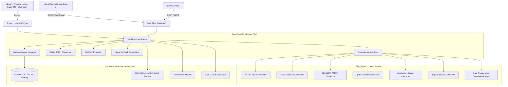

# 🌊 OpenFlow

<div align="center">

**Protocol-Agnostic Distributed Workflow Orchestrator in Go**

[](https://golang.org)
[](LICENSE)
[](https://github.com/Lab-OpenFlow/openflow/actions/workflows/ci.yml)
[](https://github.com/Lab-OpenFlow/openflow-deploy)

*BPMN-inspired, Goroutine-powered modular orchestration engine connecting Kafka, RabbitMQ, HTTP/REST, gRPC, WebSockets, Databases, and WebAssembly.*

</div>

---

## 🌌 The OpenFlow Ecosystem

OpenFlow is organized as modular, specialized repositories under the [`Lab-OpenFlow`](https://github.com/Lab-OpenFlow) organization:

| Repository | Purpose | Language / Stack |
|---|---|---|
| [**`openflow`**](https://github.com/Lab-OpenFlow/openflow) | **Core Engine**, API, Worker Pool, CLI & Operator | Go |
| [**`openflow-studio`**](https://github.com/Lab-OpenFlow/openflow-studio) | Visual Designer & Real-time Timeline Studio UI | React + Vite + TypeScript |
| [**`openflow-deploy`**](https://github.com/Lab-OpenFlow/openflow-deploy) | Docker Compose, Helm Charts & Kubernetes CRDs | DevOps / K8s |
| [**`openflow-docs`**](https://github.com/Lab-OpenFlow/openflow-docs) | Official Documentation Website & Guides | VitePress |
| [**`openflow-examples`**](https://github.com/Lab-OpenFlow/openflow-examples) | Production Workflows & E2E Simulation Scripts | YAML / Python |
| [**`openflow-go-sdk`**](https://github.com/Lab-OpenFlow/openflow-go-sdk) | Official Go Client SDK | Go |
| [**`openflow-java-sdk`**](https://github.com/Lab-OpenFlow/openflow-java-sdk) | Official JVM Client SDK (Java & Kotlin) | Java / Kotlin |
| [**`openflow-python-sdk`**](https://github.com/Lab-OpenFlow/openflow-python-sdk) | Official Python Client SDK | Python |
| [**`openflow-ts-sdk`**](https://github.com/Lab-OpenFlow/openflow-ts-sdk) | Official TypeScript / JavaScript Client SDK | TypeScript |

---

## 🚀 Key Features

- **⚡ Native Golang Engine**: Built on lightweight Goroutines and non-blocking channels for sub-millisecond stage dispatching and high-throughput concurrency.
- **🔌 Protocol Agnostic**: Pluggable connector registry supporting **Apache Kafka**, **RabbitMQ**, **HTTP/REST**, **gRPC**, **WebSockets**, and **SQL Databases**.
- **🔄 Distributed Saga & Compensations**: Automatic backward rollback (LIFO) and compensating actions on stage failure to guarantee consistency across microservices.
- **🎨 Visual Studio UI**: Drag-and-drop workflow canvas with real-time execution animation, step timeline, and bi-directional YAML synchronization (embedded directly into the Go binary).
- **🔀 BPMN & Complex Flow Control**: Exclusive XOR branching, Parallel Fork/Join Gateways, Timers/Delays, and expression-based condition evaluation.
- **🛡️ Security**: AES-GCM 256-bit Secret Vault, JWT/API Key authentication, Role-Based Access Control (RBAC), and structured audit logging.
- **📊 Cloud-Native Observability**: Prometheus metrics (`/metrics`), OpenTelemetry/Jaeger tracing, and WebSocket live event broadcast.
- **🛠️ `openflowctl` CLI**: Intuitive command-line interface for deploying, inspecting, and executing workflow definitions.

---

## 🏛️ Architecture Overview



---

## 📦 Project Structure

```text
openflow/
├── cmd/
│   ├── openflow-server/       # Central server (REST, WebSocket, Engine, Embedded Studio UI)
│   ├── openflowctl/           # CLI tool for workflow deployment and execution
│   └── openflow-operator/     # Kubernetes operator controller
├── pkg/
│   ├── model/                 # Workflow, Stage, Execution, Saga, and Event definitions
│   ├── engine/                # Core DAG engine, Goroutines, Evaluator, Retry & Saga Manager
│   ├── connectors/            # Pluggable protocol adapters (Kafka, RabbitMQ, HTTP, gRPC, DB, WS)
│   ├── storage/               # Pluggable storage (Memory, SQLite, PostgreSQL)
│   ├── security/              # AES-GCM Vault, JWT, API Keys, RBAC
│   ├── observability/         # Prometheus metrics & structured logger
│   ├── api/                   # REST API router, WebSocket Hub
│   └── ui/                    # Embedded static frontend assets
├── migrations/                # Database schema migrations
├── Makefile
├── CHANGELOG.md
├── CONTRIBUTING.md
├── SECURITY.md
└── go.mod
```

---

## 🏁 Quickstart

### 1. Run Locally with Go
```bash
# Clone repository
git clone https://github.com/Lab-OpenFlow/openflow.git
cd openflow

# Build and start server
go run cmd/openflow-server/main.go
```
The server will start at `http://localhost:8080` with the embedded **Visual Studio UI**, REST API, and WebSocket server.

### 2. Run Full Infrastructure with Docker Compose
Clone the [`openflow-deploy`](https://github.com/Lab-OpenFlow/openflow-deploy) repository to spin up PostgreSQL, Apache Kafka (KRaft), RabbitMQ, Prometheus, and Jaeger:
```bash
git clone https://github.com/Lab-OpenFlow/openflow-deploy.git
cd openflow-deploy
docker compose up -d
```

### 3. Deploy Workflows with `openflowctl` CLI
```bash
# Build CLI
go build -o openflowctl cmd/openflowctl/main.go

# Deploy a workflow from YAML (see openflow-examples repository)
./openflowctl workflow apply -f workflow.yaml

# List active workflows
./openflowctl workflow list

# Trigger workflow execution with JSON payload
./openflowctl workflow run kafka-telemetry-pipeline --data '{"device_id":"sensor-01","temperature":95.5}'

# Inspect execution instance
./openflowctl execution list
./openflowctl execution get <execution_id>
```

---

## 💡 Declarative Workflow Example

```yaml
version: "v1"
id: "bank-transfer-saga"
name: "Financial Bank Transfer with Saga Rollback"
status: "ACTIVE"

trigger:
  type: "webhook"
  path: "/webhooks/transfer"

start_at: "debit_sender"

stages:
  - id: "debit_sender"
    name: "Debit Sender Account"
    type: "http"
    config:
      url: "https://ledger.bank.internal/debit"
      method: "POST"
      body:
        account_id: "{{.payload.sender_id}}"
        amount: "{{.payload.amount}}"
    retry:
      max_attempts: 3
      backoff: "exponential"
    compensation:
      id: "refund_sender"
      name: "Refund Sender (Rollback)"
      type: "http"
      config:
        url: "https://ledger.bank.internal/refund"
        method: "POST"
    next: ["credit_receiver"]

  - id: "credit_receiver"
    name: "Credit Receiver Account"
    type: "http"
    config:
      url: "https://ledger.bank.internal/credit"
      method: "POST"
      body:
        account_id: "{{.payload.receiver_id}}"
        amount: "{{.payload.amount}}"
    next: ["publish_settlement_kafka"]

  - id: "publish_settlement_kafka"
    name: "Publish Settled Event"
    type: "kafka"
    config:
      topic: "transfers.settled"
      key: "{{.payload.transaction_id}}"
```

---

## 🌐 REST & WebSocket API Reference

| Method | Endpoint | Description |
|---|---|---|
| `GET` | `/health` | Server health and readiness check |
| `GET` | `/metrics` | Prometheus metrics scrape endpoint |
| `GET` | `/api/v1/ws` | Real-time WebSocket execution stream |
| `GET` | `/api/v1/workflows` | List all workflows with filters |
| `POST` | `/api/v1/workflows` | Create workflow (accepts JSON or YAML) |
| `GET` | `/api/v1/workflows/:id` | Get workflow definition (add `?format=yaml` for YAML) |
| `PUT` | `/api/v1/workflows/:id` | Update workflow definition |
| `DELETE` | `/api/v1/workflows/:id` | Delete workflow |
| `POST` | `/api/v1/workflows/:id/execute` | Trigger synchronous or asynchronous execution |
| `POST` | `/api/v1/triggers/webhook/*path` | Ingress endpoint for webhook triggers |
| `GET` | `/api/v1/executions` | List execution history |
| `GET` | `/api/v1/executions/:id` | Get detailed execution steps and timing |
| `GET` | `/api/v1/connectors` | List available connectors and schemas |

---

## 🧪 Testing & Verification

Run the comprehensive Go test suite:
```bash
go test -v ./pkg/...
```

---

## 📄 License
OpenFlow is released under the **Apache 2.0 License**.
